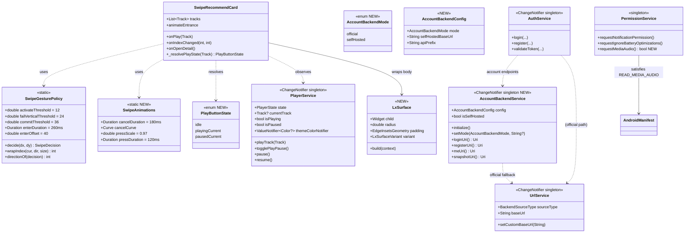
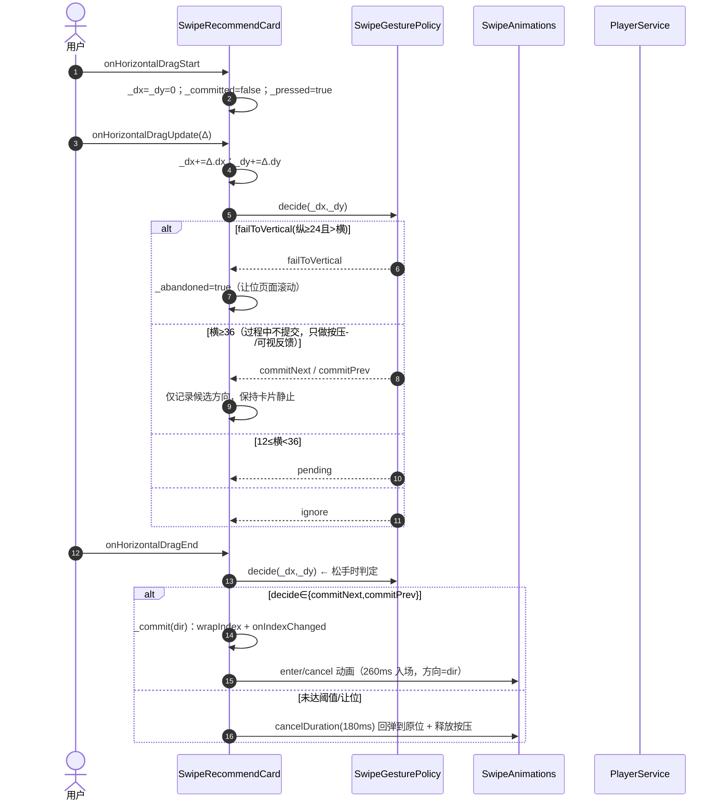
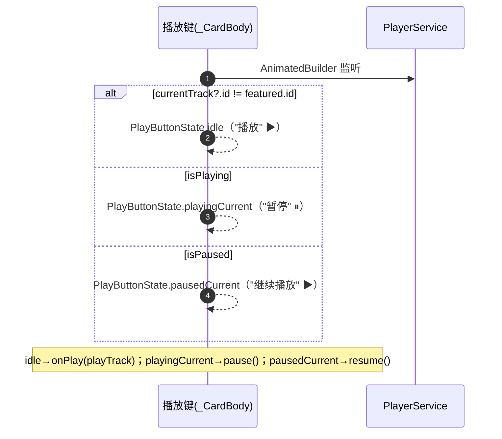
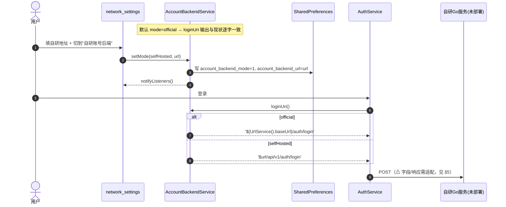
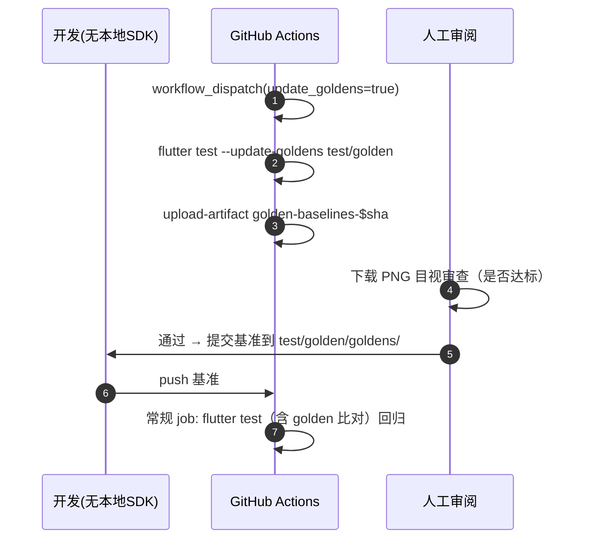
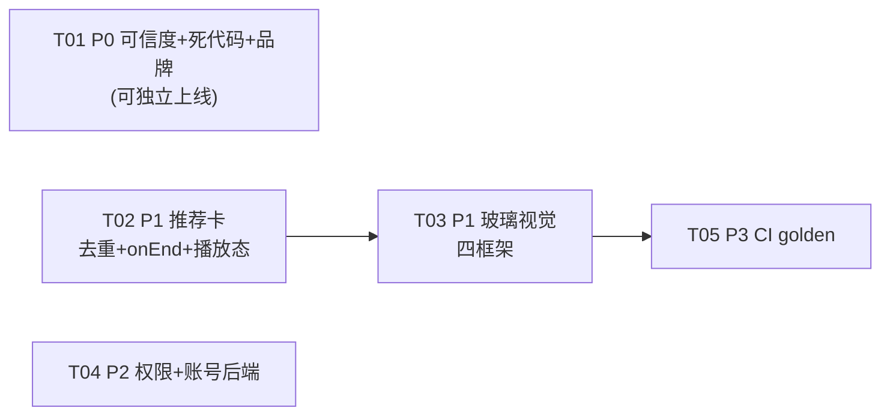

# LxPlayer 增量设计 + 任务分解（2026-09-11）

- 作者：高见远（架构师）
- 性质：**增量设计**（不是从零设计），遵循最小变更原则
- 分支：`flutter-rewrite`；参照：`docs/superpowers/research/2026-09-11-gap-analysis.md`
- 配套文件：`docs/superpowers/plans/2026-09-11-lxplayer-increment.class.mermaid`、`...increment.sequence.mermaid`

## 0. 设计约束（务必先读）

| 约束 | 含义 | 对本设计的影响 |
| --- | --- | --- |
| 无本地 Flutter SDK / 无设备 | 不能 `flutter test`、`flutter build`、看真实渲染 | **禁止大范围重构**；改动必须小而正交；任何"只靠编译通过"的改动都按高风险对待 |
| 只能靠 CI 验证 | `flutter test` ≈1.5 min 出结果，完整构建 10–15 min | 视觉/动画类改动无法本地确认 → 用**渲染级断言 + CI golden**兜底（P3） |
| 平台差异不可测 | Windows/macOS/Linux 构建不在 CI（`.github/workflows/ci.yml` 只有 android + server job） | Windows runner 品牌、macOS xcscheme 改动**列清单但标"需工程师验证"** |
| 不引入新状态管理库 | 底座是 `ChangeNotifier` 单例 + `AnimatedBuilder`/`ValueListenableBuilder` | 所有新状态沿用同一模式 |
| 不引入新依赖包 | `liquid_glass_widgets: ^0.7.13`、`permission_handler: ^11.0.0` 已在 `app/pubspec.yaml:43,88` | 视觉与权限都复用现有包 |
| 严禁改默认可用的后端 | `server/` 未部署；默认第三方后端 `https://music.nekofun.top` 是当前唯一可用登录路径 | P2-3 只加"可切换"配置，默认逐字不变 |

---

# Part A：系统设计

## 1. 实现方案与框架选型

### 1.1 核心难点与对策

| 难点 | 事实（文件:行） | 对策 |
| --- | --- | --- |
| 测试"假信心" | `lyric_highlight_test.dart:4,28` 断言 `MobilePlayerCurrentLyric`，而该组件生产代码零引用（全库 grep 仅测试引用） | 删死组件，测试改钉真实上屏组件（§P0-1） |
| 死代码误删风险 | 7 个候选文件；`login_page.dart` 自 import 另两个 | 逐个精确 grep `import` 路径确认零引用后再删（已核实，见 §P0-2） |
| 推荐卡手感与参考不一致 | `swipe_recommend_card.dart:232-236` 在 `onHorizontalDragUpdate` 立即提交 | 改 `onEnd` 提交，**保持 `SwipeGesturePolicy.decide` 语义不变**（现有单测继续通过）（§P1-2） |
| 卡片质感孤立于底座 | 卡片是实心 `surfaceContainerHigh` + Material `FilledButton`（`swipe_recommend_card.dart:207-211,326-334`），底座已有液态玻璃语言 | 复用底座先例分支，不引入新视觉语言（§P1-3） |
| 卡片在桌面端也渲染 | `charts_tab.dart:145` 桌面端与窄屏共用同一张卡（"桌面端与窄屏共用同一张卡"） | 视觉改动**必须四框架分支**，硬约束（§P1-3） |
| 媒体权限缺失 | `AndroidManifest.xml:30` 有 `READ_MEDIA_AUDIO`，但 `permission_service.dart` 无运行时请求 | 用 `permission_handler` 的 `Permission.audio` 补齐（§P2-1） |

### 1.2 框架/库选型（全部沿用，不新增）

| 用途 | 选择 | 理由 |
| --- | --- | --- |
| 状态管理 | 现有 `ChangeNotifier` 单例（`PlayerService`/`UrlService`/`AuthService`…） | 底座统一模式；不引入 provider/riverpod |
| 玻璃质感 | `liquid_glass_widgets`（已在依赖，`main.dart:106` 已 `initialize`，`main.dart:343` 已 `wrap`） | 底座已用它做底部导航栏（`main_layout.dart:673`）与迷你播放器（`mini_player.dart:504`） |
| 四框架分支 | 照抄 `MobileDailyRecommendCard` 先例（`mobile_daily_recommend_card.dart:20-55`：`isCupertino`→玻璃卡 / `isFluentFramework`→`fluent.Card` / else→Material 卡） | 已有、经生产验证、天然满足"不能只适配一套框架" |
| 权限 | `permission_handler ^11.0.0` | `Permission.audio` 即 `READ_MEDIA_AUDIO`（Android 13+），够用，无需新包 |
| 视觉证据 | `flutter test` golden（`flutter_test` 内置） | 唯一无需本地 SDK 就能产出并回归的方案（§P3-1） |

### 1.3 架构模式

不改分层。仅三处**新增**：

1. **账号后端抽象**：新增 `AccountBackendService`，让"账号链路"与"音乐解析链路"解耦——默认仍走 `UrlService`，可切换时才指向自研 Go 服务（§P2-3）。
2. **框架感知表面**：新增 `LxSurface` 无状态组件，把"玻璃 / Fluent Card / 实心 Material 卡"的分支收敛到一处（§P1-3）。
3. **手势状态机**：把推荐卡的手势从"update 即提交"改为"累积→松手判定"，并新增取消/回退（§P1-2）。

---

## 2. 文件清单

> 路径相对仓库根 `C:\Users\Administrator\Downloads\LxPlayer`。改动分级：**[P0]** 可独立上线；**[P1]/[P2]/[P3]** 后续。

### 2.1 新增文件

| 文件 | 组 | 作用 |
| --- | --- | --- |
| `app/lib/widgets/lx_surface.dart` | P1 | 框架感知表面（玻璃/Fluent 卡/实心卡）单一分支点 |
| `app/lib/services/account_backend_service.dart` | P2 | 账号后端配置项 + 端点映射（默认逐字不变） |
| `app/test/golden/swipe_card_golden_test.dart` | P3 | 推荐卡 golden（tag `golden`） |
| `app/assets/fonts/<CJK>.ttf` | P3 | golden 用确定性中文字体（见 §P3-1） |
| `docs/superpowers/plans/2026-09-11-lxplayer-increment.class.mermaid` | 交付 | 类图 |
| `docs/superpowers/plans/2026-09-11-lxplayer-increment.sequence.mermaid` | 交付 | 时序图 |
| `docs/DEPLOY_BACKEND.md` | P2 | "要部署 Go 服务才能用自研账号后端"的说明 |

### 2.2 修改文件

| 文件 | 组 | 改什么 |
| --- | --- | --- |
| `app/test/lyric_highlight_test.dart` | P0 | 改钉真实上屏歌词组件（见 §P0-1） |
| `app/README.md` | P0 | 标题 `Cyrene Music 🎵` → `LxPlayer 🎵`（:1） |
| `app/windows/runner/Runner.rc` | P0 | 产品名/公司名/InternalName/OriginalFilename（:92-98） |
| `app/windows/runner/runner.exe.manifest` | P0 | `assemblyIdentity name` → 与 native AUMID 一致（:6） |
| `app/windows/runner/updater.ps1` | P0 | 标题与日志文案（:1,:35） |
| `app/macos/Runner.xcodeproj/xcshareddata/xcschemes/Runner.xcscheme` | P0 | `BuildableName` → `lxplayer.app`（与 `PRODUCT_NAME=lxplayer` 对齐） |
| `app/lib/pages/home_for_you_tab.dart` | P1 | 去重：移除重复的 `MobileDailyRecommendCard`（:299），补"查看全部"入口 |
| `app/lib/pages/home_page/swipe_recommend_card.dart` | P1 | `onEnd` 提交 + 取消/回退动画 + 播放键三态 + 复用 `LxSurface` |
| `app/test/swipe_recommend_card_test.dart` | P1 | 新增"松手才提交/欠拖不换张仍成立"等断言（阈值断言保持不变） |
| `app/test/style_geometry_test.dart` | P1 | 新增"卡片确实挂在首页 + 框架分支"断言 |
| `app/lib/services/permission_service.dart` | P2 | 新增 `requestMediaAudio()` |
| `app/lib/services/local_library_service.dart` | P2 | 扫描前调用媒体权限（:180 起） |
| `app/lib/pages/settings_page/network_settings.dart` | P2 | 新增"账号后端"配置区 |
| `app/lib/services/auth_service.dart` | P2 | 账号端点改走 `AccountBackendService`（:301,357 …，默认输出逐字不变） |
| `app/pubspec.yaml` | P3 | `flutter.fonts` 段挂载 CJK 字体 |
| `.github/workflows/ci.yml` | P3 | 新增 golden 任务 + 上传基准 artifact |

### 2.3 删除文件

| 文件 | 组 | 依据（已验） |
| --- | --- | --- |
| `app/lib/pages/mobile_player_components/mobile_player_current_lyric.dart` | P0 | 生产零引用；仅 `lyric_highlight_test.dart` 引用 |
| `app/lib/pages/auth/login_page.dart` | P0 | 全库无 `import` 该文件（精确 grep `auth/login_page.dart` 无命中） |
| `app/lib/pages/auth/register_page.dart` | P0 | 仅被 `login_page.dart` import（同组删除） |
| `app/lib/pages/auth/forgot_password_page.dart` | P0 | 仅被 `login_page.dart` import（同组删除） |
| `app/lib/layouts/cupertino_main_layout.dart` | P0 | 精确 grep 无命中 |
| `app/lib/pages/playlists_page.dart` | P0 | 精确 grep 无命中（`NeteaseLibraryPlaylistsPage` 是另一个类，勿混淆） |
| `app/lib/pages/profile_page.dart` | P0 | 精确 grep 无命中 |
| `app/lib/services/navigator_service.dart` | P0 | 精确 grep 无命中（`NavigatorService` 类名仅出现在该文件） |
| `app/lib/services/README.md` | P0 | 上游文档残留，教人 `import 'package:cyrene_music/...'` 且指向已不存在的 OmniParse 后端（:20,:133,:157） |
| `app/lib/pages/home_page/mobile_daily_recommend_card.dart` | P1 | 去重后唯一使用点（`home_for_you_tab.dart:299`）被移除（§P1-1） |

---

## 3. 数据结构与接口

### 3.1 类图（摘要，完整见 `...increment.class.mermaid`）



### 3.2 新增接口定义（签名级，非实现）

```dart
// app/lib/services/account_backend_service.dart  (P2)
enum AccountBackendMode { official, selfHosted }

class AccountBackendConfig {
  final AccountBackendMode mode;      // 默认 official —— 不改现状
  final String selfHostedBaseUrl;     // 如 http://192.168.1.10:8080
  final String apiPrefix;             // 默认 '/api/v1'
  const AccountBackendConfig({...});
}

class AccountBackendService extends ChangeNotifier {
  static final AccountBackendService _i = AccountBackendService._internal();
  factory AccountBackendService() => _i;

  AccountBackendConfig get config;
  bool get isSelfHosted;

  Future<void> initialize();                                 // 启动时读 SharedPreferences
  Future<void> setMode(AccountBackendMode m, {String? url}); // 持久化

  // 账号端点：official 模式必须与现状逐字一致
  Uri loginUri();      // official: '${UrlService().baseUrl}/auth/login'
  Uri registerUri();   // official: '${UrlService().baseUrl}/auth/register'
  Uri meUri();         // official: '${UrlService().baseUrl}/auth/validate-token'
  Uri snapshotUri();   // 自研：'$selfHostedBaseUrl$apiPrefix/sync/snapshot'

  // SharedPreferences 键（新增，默认值保证向后兼容）
  static const kModeKey = 'account_backend_mode';   // int，0=official（默认）
  static const kUrlKey  = 'account_backend_url';    // string，默认 ''
}
```

```dart
// app/lib/widgets/lx_surface.dart  (P1)
enum LxSurfaceVariant { card, control }

class LxSurface extends StatelessWidget {
  const LxSurface({ required this.child, this.radius = 28,
                    this.padding = EdgeInsets.zero, this.variant = LxSurfaceVariant.card });
  final Widget child;
  final double radius;
  final EdgeInsetsGeometry padding;
  final LxSurfaceVariant variant;
  // build(): ThemeManager 分支
  //   移动端 Cupertino/Oculus → GlassContainer(liquid_glass_widgets)
  //   桌面 Fluent            → fluent.Card
  //   Material               → Container(surfaceContainerHigh, radius)
}
```

```dart
// app/lib/pages/home_page/swipe_recommend_card.dart  (P1 增量)
enum PlayButtonState { idle, playingCurrent, pausedCurrent }

// SwipeGesturePolicy 阈值/入场常量保持不动，仅新增：
abstract final class SwipeAnimations {
  static const cancelDuration = Duration(milliseconds: 180); // 未达阈值松手的回弹
  static const cancelCurve = Curves.easeOut;
  static const pressScale = 0.97;                            // 按压反馈
  static const pressDuration = Duration(milliseconds: 120);
}

// SwipeRecommendCard 新增可选回调 onOpenDetail（承载原 MobileDailyRecommendCard 的"查看全部"）
```

```dart
// app/lib/services/permission_service.dart  (P2 增量)
Future<bool> requestMediaAudio(); // Android13+ → Permission.audio；<13 → Permission.storage；其它平台 true
```

---

## 4. 关键调用流程

### 4.1 推荐卡：松手提交 + 取消/回退（P1-2 + P1-4）



**播放键三态**（同文件，`_CardBody` 内）：



### 4.2 账号后端切换（P2-3）



### 4.3 视觉证据（P3-1）



---

## 5. 待明确事项（不猜，标注）

| # | 待明确 | 影响 | 处理 |
| --- | --- | --- | --- |
| U1 | `MobilePlayerKaraokeLyric` 能否在 widget test 中 `pump`（无插件依赖） | P0-1 测试方案 | 理论可行（仅依赖 `PlayerService()` 空构造 + `themeColorNotifier`）；**需工程师先验证**：pump 后无异常、能取到布局 |
| U2 | App 默认歌词样式实为 **fluidCloud**（`lyric_style_service.dart:80`） | P0-1 钉哪个组件"算真实上屏" | 见 §P0-1 决策：钉 karaoke（语义匹配），并把 fluidCloud 交给 P3 golden 兜底；若 U1 不成立则退而钉 fluidCloud 面板 |
| U3 | 自研 Go 服务响应体是裸 JSON（`server/main.go:188` `writeJSON(map...)`），而 `AuthService` 期望的字段结构未核对 | P2-3 自研模式能否直接用 | **需工程师核对**：字段名、token 字段、错误码。本轮只保证 official 逐字不变；selfHosted 视为"需适配层"的 stretch |
| U4 | Windows/macOS 不构建于 CI | P0-3 品牌改动无法被 CI 验证 | 只做字符串级对齐（与 native/`PRODUCT_NAME` 一致的改法），**需工程师验证**：manifest 名与 `main.cpp:60` AUMID 同值 |
| U5 | golden 在 Linux CI 上的中文渲染 | P3-1 基准是否稳定 | 需随附/加载确定性 CJK 字体（§P3-1），否则中文渲染为方块；**需工程师先跑一次确认** |
| U6 | Flutter stable 版本漂移会让 golden 抖动 | P3-1 回归可靠性 | CI 两处 golden job 固定 `flutter-version`（见任务 T05） |
| U7 | `MANAGE_EXTERNAL_STORAGE` 是否保留 | P2-1 | 不建议运行时请求（Play 上架风险），仅补 `READ_MEDIA_AUDIO` 运行时请求 |

---

# Part B：任务分解

## 6. 依赖包

**不新增任何依赖包。** 全部复用：

```
- liquid_glass_widgets@^0.7.13  # app/pubspec.yaml:43（玻璃质感，P1-3）
- permission_handler@^11.0.0    # app/pubspec.yaml:88（Permission.audio，P2-1）
- flutter_test (SDK 内置)        # golden（P3-1）
```
P3 仅新增**字体 asset**（非包），并可能新增 `pubspec.yaml` 的 `flutter.fonts` 段。

## 7. 任务列表（按依赖排序，粒度到文件）

> 硬性达标：共 **5** 个任务（≤5）；每任务 ≥3 文件；按模块分组；T01 为可独立发布的 P0 组。

---

### T01 — P0 可信度修复 + 死代码清理 + 品牌收尾　`[P0，无依赖，可独立上线]`

| 项 | 内容 |
| --- | --- |
| **源文件** | **删除**：`app/lib/pages/mobile_player_components/mobile_player_current_lyric.dart`、`app/lib/pages/auth/login_page.dart`、`register_page.dart`、`forgot_password_page.dart`、`app/lib/layouts/cupertino_main_layout.dart`、`app/lib/pages/playlists_page.dart`、`app/lib/pages/profile_page.dart`、`app/lib/services/navigator_service.dart`、`app/lib/services/README.md`<br>**修改**：`app/test/lyric_highlight_test.dart`、`app/README.md`、`app/windows/runner/Runner.rc`、`app/windows/runner/runner.exe.manifest`、`app/windows/runner/updater.ps1`、`app/macos/Runner.xcodeproj/xcshareddata/xcschemes/Runner.xcscheme` |
| **依赖** | 无 |
| **优先** | P0 |
| **验收** | `flutter test` 全绿；`flutter build apk` 成功；无新增 lint 错误 |

**关键决策**

- **P0-1 决策：删死组件 + 测试改钉 `MobilePlayerKaraokeLyric`（classic 布局组件）。**
  - 理由：(a) `MobilePlayerCurrentLyric` 的唯一消费者就是测试本身 → 保留 = 长期背一个无产品角色的组件；(b) 原测试的语义（3 行、当前行在第 2 行、更大更粗、非当前行半透明）与 `MobilePlayerKaraokeLyric` 一致（`mobile_player_karaoke_lyric.dart:227-318`），而与默认 fluidCloud 面板（7 行、缩放式）不一致；(c) 改测试成本低于把死组件接进产品。
  - 备选（若 U1 不成立）：钉 `MobilePlayerFluidCloudLyricsPanel`（默认样式）——但断言需整体重写，且组件依赖 `LyricFontService`，风险更高；此时至少先删死组件。
  - **test 重写要点（非 import 替换）**：karaoke 当前行不是 `AnimatedDefaultTextStyle`（走 `_buildKaraokeText` Stack + ClipRect），非当前行才是。断言应改为：3 行槽位、当前行以卡拉OK填充（bold + 高亮色）、非当前行字号更小且 `FontWeight.normal`、窗口随索引移动。
- **P0-2**：7 个文件已逐一精确 grep `import` 确认零引用（含动态路由字符串 / 反射式类名查找）。`linuxdo_webview_login_page.dart` **必须保留**（被 `auth_page.dart:10`、`fluent_auth_page.dart:6` 引用）。
- **P0-3 品牌收尾规则**——见 §P0-3 明细表；**必须区分**"应改"与"上游署名必须保留"。

---

### T02 — P1 推荐卡：去重入口 + 松手提交 + 播放键三态　`[P1，无依赖]`

| 项 | 内容 |
| --- | --- |
| **源文件** | `app/lib/pages/home_for_you_tab.dart`、`app/lib/pages/home_page/swipe_recommend_card.dart`、`app/test/swipe_recommend_card_test.dart`、`app/test/style_geometry_test.dart`；**删除** `app/lib/pages/home_page/mobile_daily_recommend_card.dart` |
| **依赖** | 无 |
| **优先** | P1 |
| **验收** | 两个旧测试文件全绿（阈值断言不变）；新增"松手越过 36 才换张""欠拖不换张""拖动过程中卡片静止"断言；`home_for_you_tab` 内 `dailySongs` 只出现一次 |

**关键决策**

- **P1-1 决策：保留 `SwipeRecommendCard`（首页 hero），移除重复的 `MobileDailyRecommendCard`（`home_for_you_tab.dart:299`）。**
  - 理由：(a) `SwipeRecommendCard` 是手写、有测试、匹配参考实现（Hyacine）的那张；(b) 两者同一批 `data.dailySongs`（:292 与 :299）确实重复；(c) 为保留"查看全部/详情"能力，给 `SwipeRecommendCard` 增加可选 `onOpenDetail`，在卡片头部放"查看全部 >"，接原 `widget.onOpenDailyDetail`（`home_for_you_tab.dart:301`）。
  - 删除 `mobile_daily_recommend_card.dart`：去重后其唯一使用点消失（grep 确认仅 `home_for_you_tab.dart:299`）。**需工程师最后再 grep 一次确认无新引用**。
- **P1-2 决策：保留 `SwipeGesturePolicy.decide` 原语义（12/24/36），只把**调用时机**从 `onHorizontalDragUpdate` 移到 `onHorizontalDragEnd`。**
  - 因此 `swipe_recommend_card_test.dart` 里对 `decide(-36,0)==commitNext` 等断言**继续成立**；`style_geometry_test.dart` 用 `tester.drag(...)`（含 down→move→up）仍会触发 `onEnd`，`左滑越过提交阈值切到下一张` 保持通过。
  - 新增取消/回退：未达阈值松手 → `SwipeAnimations.cancelDuration(180ms)` 回弹 + 释放按压。
- **P1-4 决策：`PlayButtonState` 三态由 `PlayerService` 派生**（`currentTrack?.id` 比较 + `isPlaying/isPaused`），点击分别 `onPlay(playTrack)` / `pause()` / `resume()`（`player_service.dart:1599,1614,1925`）。

---

### T03 — P1 视觉对齐：玻璃质感（四框架）　`[P1，依赖 T02]`

| 项 | 内容 |
| --- | --- |
| **源文件** | **新增** `app/lib/widgets/lx_surface.dart`；**修改** `app/lib/pages/home_page/swipe_recommend_card.dart`（`_CardBody` 用 `LxSurface` 包裹、播放键换用玻璃/一致控件）、`app/test/style_geometry_test.dart`（新增框架分支断言） |
| **依赖** | T02（同一文件，须串行） |
| **优先** | P1 |
| **验收** | 卡片在 Cupertino/Oculus/Fluent/Material 四种下都有明确分支（可在测试中以 stub 框架断言）；无新视觉语言；`liquid_glass_widgets` 参数抄底座既有值 |

**关键决策（硬约束：不能只适配一套框架）**

- 照抄底座先例 `mobile_daily_recommend_card.dart:20-55`：**Cupertino/Oculus → 玻璃卡；Fluent → `fluent.Card`；Material → 实心 `surfaceContainerHigh` 卡**。
- 玻璃参数复用 `mini_player.dart:504-523` 的 Cupertino 分支取值（light `thickness 20 / blur 3`、dark `thickness 35 / blur 4`、`specularSharpness: medium`），**不新造视觉语言**。
- 播放键：`variant: control` → 玻璃控件；材料框架回退到现有 `FilledButton`（**保留 `style_geometry_test` 能取到的稳定盒模型**，避免动画导致 `getSize` 抖动）。

---

### T04 — P2 功能可用性：媒体权限 + 账号后端可切换　`[P2，无依赖]`

| 项 | 内容 |
| --- | --- |
| **源文件** | **新增** `app/lib/services/account_backend_service.dart`、`docs/DEPLOY_BACKEND.md`；**修改** `app/lib/services/permission_service.dart`、`app/lib/services/local_library_service.dart`、`app/lib/pages/settings_page/network_settings.dart`、`app/lib/services/auth_service.dart`、`app/lib/main.dart`（`AccountBackendService().initialize()`） |
| **依赖** | 无 |
| **优先** | P2 |
| **验收** | 未改默认后端（official 端点逐字不变，跑通现有登录）；Android 扫描前弹出媒体权限；新增配置项持久化 |

**关键决策**

- **P2-1**：`permission_service.dart` 新增 `requestMediaAudio()`（`Permission.audio`；<13 回退 `Permission.storage`），在 `local_library_service.dart:180` 的 `pickAndScanFolder` 目录列举前调用。**不**运行时请求 `MANAGE_EXTERNAL_STORAGE`（上架风险）。
- **P2-3（重要约束）**：**默认必须仍是 official**，`AccountBackendService.loginUri()` 在 official 下返回 `'${UrlService().baseUrl}/auth/login'`——与 `auth_service.dart:358` 现状逐字相同。自研 Go 服务仅在用户**自行部署**后，于 `network_settings.dart` 填入地址并切换才生效。`docs/DEPLOY_BACKEND.md` 必须写明"要部署 Go 服务（`server/`，`go run` / 二进制）才能用自研账号后端"。
  - ⚠ 自研端点是 `/api/v1/auth/login` 等（`server/main.go:101-106`），与 App 现状 `/auth/login` **不同**；响应体是裸 JSON。因此 selfHosted 模式**需要字段适配层**，属 U3——本轮先落"配置项 + official 逐字不变"，适配层标为 stretch 并由工程师核对。
- **P2-2 倍速：本轮不纳入。** 理由：播放链路是 media_kit + audioplayers 双后端（`player_service.dart`），`setRate` 需两路都实现并做持久化/UI，且**无法本地验证真机播放**（无 SDK/设备），风险不成比例。给出后续评估要点：双后端 + 与 `position` 回调节流（`:354` 注释说进度不再 notify）交互，需专门一轮。

---

### T05 — P3 视觉证据：CI golden 基准 + 回归　`[P3，依赖 T03]`

| 项 | 内容 |
| --- | --- |
| **源文件** | **新增** `app/test/golden/swipe_card_golden_test.dart`、`app/assets/fonts/<CJK>.ttf`、`app/test/golden/goldens/*.png`（人审后提交）；**修改** `.github/workflows/ci.yml`、`app/pubspec.yaml` |
| **依赖** | T03（基准须在视觉定型后取） |
| **优先** | P3 |
| **验收** | `workflow_dispatch(update_goldens=true)` 产出 artifact；下载可见 PNG；提交后常规 `flutter test` 能比对 |

**关键决策（在无本地 SDK 前提下可行）**

- 基准**不由本地生成**（本机无 Flutter 无法 `--update-goldens`，这正是 `style_geometry_test.dart:13-14` 当初放弃 golden 的原因）。改为：**CI 生成 → artifact → 人工审阅 → 提交 → 回归**。
- CI 新增 golden 步骤（仅 `workflow_dispatch` 且 `inputs.update_goldens == 'true'`）：`flutter test --update-goldens test/golden`，`upload-artifact` 名 `golden-baselines-${{ github.sha }}`。
- 回归：常规 job 保持 `flutter test`；基准提交后 golden 自动参与比对。
- 稳定性：两个 golden 相关 job **固定 `flutter-version`**（不用 `channel: stable` 浮动），并 `setSurfaceSize` 固定画布；**加载确定性 CJK 字体**（`FontLoader` + 随仓库字体 asset）避免中文渲染成方块（U5）。
- 备选（不选）：`flutter drive` 截图——需要设备/模拟器，Linux CI 起 Android 模拟器成本高且桌面构建未验证，故不采用。

**任务依赖图**



## 8. 共享知识（跨文件约定）

**命名 / 常量**

- 手势阈值 12/24/36 **只在** `SwipeGesturePolicy` 定义（`swipe_recommend_card.dart:32-34`），禁止散落字面量。入场 `260ms / 40dp` 保留。
- 新增动画常量统一放 `SwipeAnimations`（`cancelDuration=180ms`、`cancelCurve=easeOut`、`pressScale=0.97`、`pressDuration=120ms`）。**不得**改动 260/40/12/24/36 的既有值。
- 新增服务沿用 `<Xxx>Service` 单例 + `ChangeNotifier` 模式（与 `PlayerService`/`UrlService` 一致）。

**颜色 / 表面 token**

- 玻璃参数**只在 `LxSurface`** 内配置，取值抄 `mini_player.dart:504-523`（light `thickness 20/blur 3`，dark `thickness 35/blur 4`，`specularSharpness: medium`）。
- 非玻璃回退用 `colorScheme.surfaceContainerHigh`（与现状一致）。
- 四框架分支唯一入口是 `LxSurface`，**禁止**在业务组件内散写 `Platform.isXXX` 分支。

**持久化键（SharedPreferences，新增）**

- `account_backend_mode`（int，`0=official` 默认）、`account_backend_url`（string，默认 `''`）。默认值保证老用户行为不变。
- 复用已有键：`backend_source_type`/`custom_base_url`（`url_service.dart:46,50`）、`lyric_style`（`lyric_style_service.dart:31`）。

**品牌替换规则（P0-3）**

- 产品显示名：`Cyrene Music` → `LxPlayer`。
- 可执行名/内部名（须与产物一致）：`cyrene_music.exe`→`lxplayer.exe`（`windows/CMakeLists.txt:7` = `lxplayer`）、`InternalName "CyreneMusic"`→`"LxPlayer"`、`cyrene_music.app`→`lxplayer.app`（`AppInfo.xcconfig:8` = `lxplayer`）。
- 应用标识（AUMID）：`CyreneMusic.MusicPlayer` → `LxPlayer.MusicPlayer`（与 native `main.cpp:60` / `smtc_plugin.cpp:159` 的 `LxPlayer.MusicPlayer.Desktop.1` 对齐）。
- 缓存密钥**不动**（代码里已是 `LxPlayerCacheKey2025`，`cache_service.dart:120`）。
- **禁止替换**：仓库根 `README.md` 中 CyreneMusic 的上游署名链接、`LICENSE`、`docs/superpowers/**`、`.workbuddy/**`。

## 9. P0-3 品牌残留完整清单与分类

| 类别 | 文件（命中数） | 处置 |
| --- | --- | --- |
| **A. 应改为 LxPlayer** | `app/README.md`(1)、`app/windows/runner/Runner.rc`(6)、`app/windows/runner/runner.exe.manifest`(2)、`app/windows/runner/updater.ps1`(2)、`app/macos/.../Runner.xcscheme`(4) | 按 §8 规则改 |
| **A′. 应改（低优先，可批量）** | `app/WARP.md`(2，且描述的是已不存在的 Bun/Elysia 后端)、`app/check_nesting.py`(1，硬编码 `d:\work\cyrene_music\...`)、`app/scripts/*`(5 个脚本共 13 处)、`app/.agent/workflows/configure-lxmusic-source.md`(1)、`app/docs/*`(30 个工程文档) | 仅字符串替换；与构建无关，可放最后 |
| **B. 必须保留（上游署名/许可/历史）** | 根 `README.md`(2，CyreneMusic 上游链接与说明)、`LICENSE`、`docs/superpowers/**`（本增量与调研文档）、`.workbuddy/**`（协作记录） | **禁止替换** |
| **C. 内容已过期 → 勿盲目替换品牌** | `app/docs/CYRENE_FILE_FORMAT.md`(20)、`app/docs/MUSIC_CACHE.md`(20)（描述旧 `.cyrene` 格式与旧密钥 `CyreneMusicCacheKey2025`，代码已改为 `.lxcfg` + `LxPlayerCacheKey2025`）、`app/lib/services/README.md`(3，教 `package:cyrene_music` + 已不存在的 OmniParse 后端) | 删除或加"已过期"标注；**不要把旧密钥改成新名冒充有效文档** |

> 计数口径：`grep -rIl -i cyrene` 共 **53** 个文件（含本轮新增的 `docs/superpowers` 文档）。产品/构建相关需改的集中在 A + A′。

## 10. 各范围决策小结（供验收对照）

| 项 | 决策 | 落点 |
| --- | --- | --- |
| P0-1 | 删死组件 `mobile_player_current_lyric.dart` + 测试改钉 `MobilePlayerKaraokeLyric` | T01 |
| P0-2 | 删 7 个零引用文件 + `services/README.md`；`linuxdo_webview_login_page.dart` 保留 | T01 |
| P0-3 | A 类改、B 类保留、C 类标过期 | T01 |
| P1-1 | 保留 `SwipeRecommendCard`，删重复的 `MobileDailyRecommendCard`，补"查看全部" | T02 |
| P1-2 | `decide` 语义不变，改 `onEnd` 提交 + 取消/回退动画 | T02 |
| P1-3 | `LxSurface` 四框架分支，复用底座玻璃参数 | T03 |
| P1-4 | `PlayButtonState` 三态（idle/playingCurrent/pausedCurrent） | T02 |
| P2-1 | 补 `Permission.audio` 运行时请求；不请求 MANAGE_EXTERNAL_STORAGE | T04 |
| P2-2 | **本轮不纳入**（双后端 + 无法本地验证） | — |
| P2-3 | 新增可切换账号后端，**默认 official 逐字不变**；自研需适配层 + 部署文档 | T04 |
| P3-1 | CI 产 golden 基准 artifact → 人审 → 提交 → 回归 | T05 |
